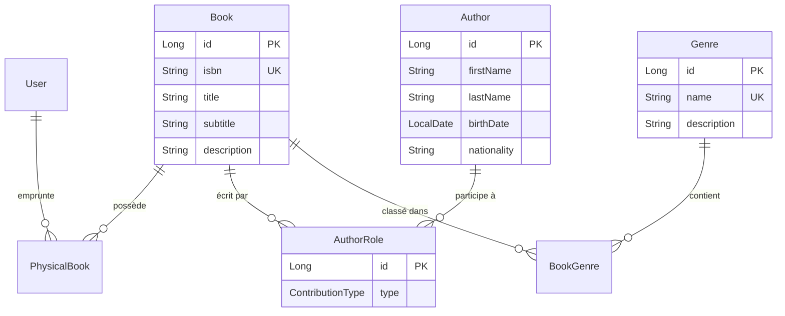

# 📚 BookFlow - Modern Library Management System

[](https://openjdk.java.net/projects/jdk/21/)
[](https://spring.io/projects/spring-boot)
[](https://www.postgresql.org/)
[](https://maven.apache.org/)

## 🎯 Vue d'ensemble

**BookFlow** est un système moderne de gestion de bibliothèque développé avec **Spring Boot 3** et **Angular 19**. Ce projet implémente une **architecture hexagonale** robuste, conçue pour évoluer avec les besoins métier tout en maintenant une séparation claire des responsabilités.

### ✨ Fonctionnalités actuelles (MVP)

- 🔍 **Recherche de livres** : Par titre, ISBN, ou auteur
- 👥 **Gestion des auteurs** : Consultation et relations avec les œuvres
- 🏷️ **Classification par genres** : Organisation thématique avec intensité (primaire/secondaire)
- 📊 **API REST complète** : Endpoints documentés et testés
- 🛡️ **Validation multicouches** : Sécurité et règles métier

## 🏗️ Architecture

### Architecture Hexagonale (Ports & Adapters)

```
📦 com.bookflow.book_flow
├── 🏛️ domain/                    # Cœur métier (Business Logic)
│   ├── entities/                 # Entités JPA avec logique métier
│   ├── enums/                    # Types métier
│   └── repositories/             # Ports (Interfaces)
│
├── 🔧 application/               # Couche applicative (Use Cases)
│   ├── dto/                      # Objets de transfert
│   ├── services/                 # Orchestration métier
│   ├── mappers/                  # Transformation des données
│   ├── validators/               # Règles de validation avancées
│   └── exceptions/               # Gestion d'erreurs métier
│
└── 🌐 infrastructure/            # Adapters (Détails techniques)
    ├── controllers/              # API REST
    └── exceptions/               # Gestion globale des erreurs
```

### 🎯 Principes de conception

- **Séparation des responsabilités** : Chaque couche a un rôle défini
- **Inversion de dépendance** : Le domaine ne dépend d'aucune technologie
- **Évolutivité** : Architecture prête pour de nouvelles fonctionnalités
- **Testabilité** : Isolation des couches pour tests unitaires et d'intégration

## 🛠️ Stack Technique

### Backend
- **Java 21** - LTS avec les dernières fonctionnalités
- **Spring Boot 3.5.4** - Framework principal
- **Spring Data JPA** - Persistance ORM
- **Spring Validation** - Validation des données
- **PostgreSQL** - Base de données relationnelle
- **Lombok** - Réduction du boilerplate
- **Maven** - Gestion des dépendances

### Tests
- **JUnit 5** - Framework de tests
- **AssertJ** - Assertions fluides
- **Spring Boot Test** - Tests d'intégration
- **TestContainers** (prévu) - Tests avec base réelle

## 📊 Modèle de données

### Entités principales



### 🔗 Relations métier intelligentes

- **AuthorRole** : Permet de gérer différents types de contributions (Auteur, Co-auteur, Traducteur, Illustrateur)
- **BookGenre** : Classification avec intensité (Primaire/Secondaire) pour une catégorisation nuancée
- **PhysicalBook** : Séparation entre l'œuvre intellectuelle et ses exemplaires physiques

## 🚀 Installation et lancement

### Prérequis
- ☕ Java 21+
- 🐘 PostgreSQL 13+
- 📦 Maven 3.8+

### Configuration

1. **Clone du repository**
```bash
git clone https://github.com/votre-username/bookflow.git
cd bookflow
```

2. **Configuration base de données**
```yaml
# src/main/resources/application.yml
spring:
  datasource:
    url: jdbc:postgresql://localhost:5432/bookflow_db
    username: votre_username
    password: votre_password
```

3. **Création de la base**
```sql
CREATE DATABASE bookflow_db;
```

4. **Lancement**
```bash
./mvnw spring-boot:run
```

L'application sera accessible sur `http://localhost:8080`

## 📋 API Endpoints

### 📚 Livres
```http
GET    /api/books                    # Liste tous les livres
GET    /api/books/{isbn}             # Livre par ISBN
GET    /api/books/search?title={}    # Recherche par titre
POST   /api/books                    # Création d'un livre
GET    /api/books/{id}/authors       # Auteurs d'un livre
GET    /api/books/{id}/genres        # Genres d'un livre
```

### 👥 Auteurs
```http
GET    /api/authors/{id}/books       # Livres d'un auteur
```

### Exemples de requêtes

**Création d'un livre :**
```json
POST /api/books
{
  "isbn": "9782070411290",
  "title": "L'Étranger",
  "subtitle": "Roman",
  "description": "Premier roman d'Albert Camus publié en 1942"
}
```

## 🧪 Tests

### Structure de tests
```
📦 src/test/java
├── 🏛️ domain/
│   ├── entities/                 # Tests unitaires entités
│   └── repositories/             # Tests repositories (DataJpaTest)
├── 🔧 application/               # Tests services
├── 🌐 infrastructure/
│   └── controllers/              # Tests d'intégration API
└── 🛠️ utils/
    └── TestDataFactory.java     # Factory pour données de test
```

### Lancement des tests
```bash
# Tests unitaires
./mvnw test

# Tests d'intégration
./mvnw test -Dtest="**/*IntegrationTest"

# Coverage
./mvnw clean test jacoco:report
```

## 🔍 Validation et sécurité

### Validation multicouches

1. **Validation Bean Validation** (`@Valid`)
   - Contraintes de base (NotBlank, Size, etc.)
   
2. **Validation métier custom** (`BookRequestValidator`)
   - Vérification format ISBN-13 avec checksum
   - Protection XSS et injection
   - Règles de cohérence métier

### Gestion d'erreurs
- **GlobalExceptionHandler** : Centralisation du traitement d'erreurs
- **Codes d'erreur typés** : Classification des erreurs métier
- **Réponses standardisées** : Format uniforme pour les clients

## 🛣️ Roadmap

### 🎯 Phase 2 - Gestion des utilisateurs
- [ ] Entité User complète
- [ ] Authentification JWT
- [ ] Profils utilisateurs (Étudiant, Professeur, Classique)
- [ ] API CRUD utilisateurs

### 🎯 Phase 3 - Système d'emprunts
- [ ] Entité Loan (Emprunt)
- [ ] Règles métier d'emprunt
- [ ] Historique des emprunts
- [ ] Notifications de retour

### 🎯 Phase 4 - Fonctionnalités avancées
- [ ] Système de réservation
- [ ] Recommandations personnalisées
- [ ] Analytics et reporting
- [ ] API de notification

### 🎯 Phase 5 - Performance et monitoring
- [ ] Pagination et filtrage avancé
- [ ] Cache Redis
- [ ] Monitoring avec Actuator
- [ ] Documentation OpenAPI/Swagger

## 💡 Choix techniques et justifications

### Pourquoi l'architecture hexagonale ?
- **Évolutivité** : Facilite l'ajout de nouvelles fonctionnalités
- **Testabilité** : Isolation des couches pour tests unitaires
- **Maintenabilité** : Séparation claire des responsabilités
- **Standard entreprise** : Architecture reconnue et demandée

### Pourquoi des entités de liaison ?
- **Flexibilité** : `AuthorRole` permet d'ajouter des métadonnées (rôle, date de participation)
- **Évolutivité** : `BookGenre` prépare la classification avancée
- **Intégrité** : Contraintes métier au niveau base

### Approche MVP itérative
- **Livraison continue** : Fonctionnalités indépendantes
- **Feedback rapide** : Validation concept par les utilisateurs
- **Risque maîtrisé** : Développement incrémental


*Développé avec ❤️ pour démontrer une architecture Spring Boot moderne et évolutive*
